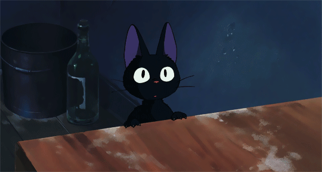

<!--- Banner -->

  

  

<!--- About me -->
### Sobre mim

Sou estudante de `Engenharia da Computação` no **IFSP Câmpus Birigui**.
Tenho grande interesse em análise de dados e desenvolvimento, unindo lógica, tecnologia e criatividade para transformar informações e necessidades em aplicações funcionais.
Tenho experiência em projetos em `Java`, `Python`, `.NET`, `Javascript` e atualmente estou aprendendo mais sobre `Análise de Dados`! 
Sou muito curiosa e estou constantemente atualizando meus conhecimentos e buscando novos desafios na área de tecnologia!

 

--- 

<!--- My stacks -->

### Tecnologias que uso

  
  
  
  
  
  
  
 
  
  
  
  
  
  
  

#### Tools
  
  
  
  
  
  
  

--- 

    
### Um pouco mais sobre mim! 
Eu gosto de desafios que me fazem crescer! 
Gosto de ajudar pessoas usando a tecnologia.
Acredito que a tecnologia é capaz de transformar a vida das pessoas para melhor, e é por isso que sigo aprendendo, criando e buscando soluções que façam a diferença.  
Sou a maior fã existente de `One Piece` e `Mangas`!

**Fale comigo:**

  
  
  

    

---

<picture>
  <source media="(prefers-color-scheme: dark)" srcset="https://raw.githubusercontent.com/anarodan/anarodan/output/pacman-contribution-graph-dark.svg">
  <source media="(prefers-color-scheme: light)" srcset="https://raw.githubusercontent.com/anarodan/anarodan/output/pacman-contribution-graph.svg">
  
</picture>

---

  

<!-- Statistics -->
### Estatísticas

|  |  |  |
| :-: | :-: | :-: |

|  |  |
| :-: | :-: |

--- 

  

  

  Obrigada por visitar meu perfil! 💜

